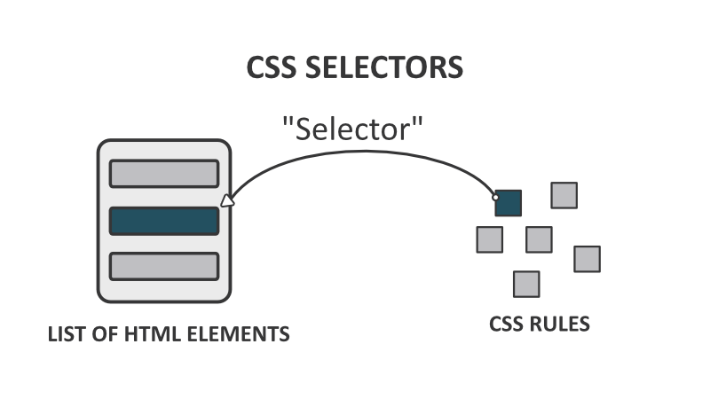
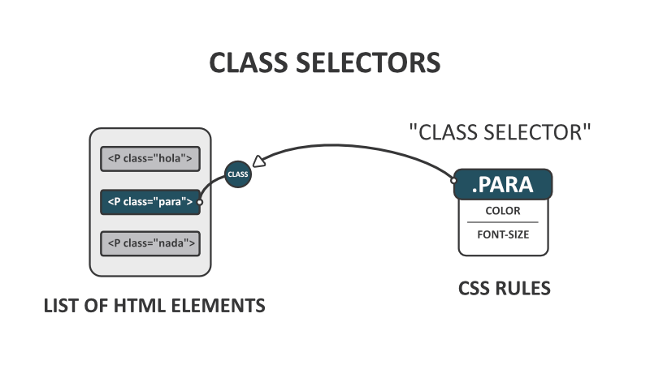
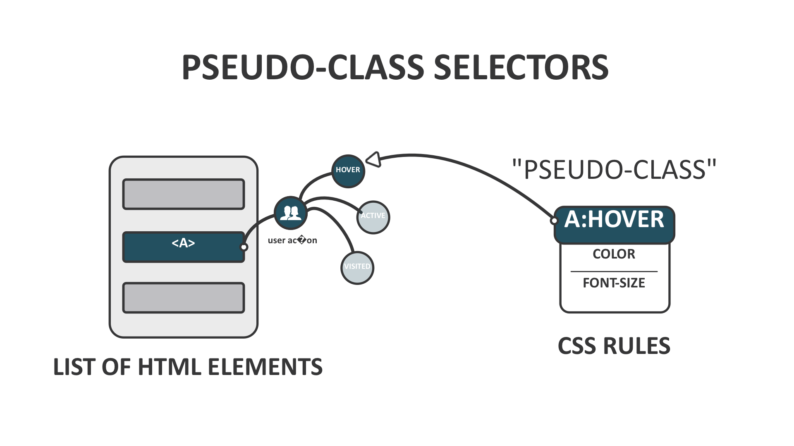

# CSS Selectors

Welcome to a very important part of css, the **selectors**.

Do you remember this visual from the introduction ?


A CSS selector is the part of a CSS rule set that selects the content you want to style. Selectors are what allows the browser to know which html element(s) should be painted with which CSS properties.



For example examine this piece of HTML:

```html
<div class="becode">
  <p>I am on my way to become a web-developer!</p>
</div>
<div id="white-background"></div>
```

If I want to have a blue background on the first div, I could do this in CSS:

```css
div {
  height: 100px;
  width: 100px;
  background-color: blue;
}
```

However, if you do this, you will notice that both div elements will have a blue background.

That's why there more selectors then just the div selector!
For example, we have written class 'becode', why not use it in our css file?

We can select class elements like this:

```css
.becode{
     height:100px;
     width:100px;
     background-color:blue;
}
```

Now only the background of our first div will be changed, just like we wanted!

What you did here, my friend, was using a **class selector**.



The Class Selector is indicated by a leading period (the `.`character) immediately follow by the class name you want to use. It can be anything, as long as it is the same as in the HTML file.

So, if in the html, the class name is "burger", the CSS class selector will be .... `.burger`. If the html class name is "ferrari", the CSS class selector becomes.... `.ferrari`. Got it ?

There are many ways to select html elements using the CSS selectors. Too many for this course. Know that the class selectors are the most used and will allow you to select everything you need, especially if you also know how to use...

### Pseudo-class selectors

Most elements like H1, P ... are not meant to be interactive. But some are, like links which in HTML are called **Anchors** and are coded using the `A`tag.

Examine this CSS, styling all anchors on your page so that they look like the IKEA logo.

```css
a.ikea {
  text-decoration: none; /* remove underline */
  background-color: blue; /* paint the background blue */
  color: yellow; /* paint the text yellow */
  font-weight: bold; /* make the characters bold */
  text-transform: uppercase; /* turn characters in UPPERCASE */
  padding: 5px 10px; /* add some padding */
  font-size: 23px; /* make the text bigger */
}
```

So now, in your html, you can add the class `"ikea"` to all links that you want to look like they were bought at IKEA :-)

```html
<p>
  I loooooove design, especially furniture from
  <a href="http://aeki.com" class="ikea">Aeki</a>. It's cheap and stylish...
  Okay, if you actually manage to build them!!
</p>
```

Result:


Cool, but if you go with your mouse on top of it, nothing happens. Sad, for an interactive element!

That's where Pseudo-class enter the game...



CSS "pseudo-classes" allow you to control the look of intermediary / temporary states of an element. At any given time, an `<a href>` element can be in a number of different states, and you can use pseudo-classes to style each one of them individually. Think of them as class selectors that you don’t have to write on your own because they’re built into the browser.

### basic link styles

Oliver James (InternetingIsHard.com) summarizes the syntax as such:

"Pseudo-classes begin with a colon followed by the name of the desired class. The most common link pseudo-classes are as follows:

- `:link` – A link the user has never visited.
- `:visited` – A link the user has visited before.
- `:hover` – A link with the user’s mouse over it.
- `:active` – A link that’s being pressed down by a mouse (or finger).
"
(source: https://www.internetingishard.com/html-and-css/css-selectors/#pseudo-classes-for-links)

That's about it for the CSS Selectors. You have enough information to do the exercises! Don't hesitate to go back here if you cannot manage the exercises - you cannot remember all this. Practice will help you remember ;-)
